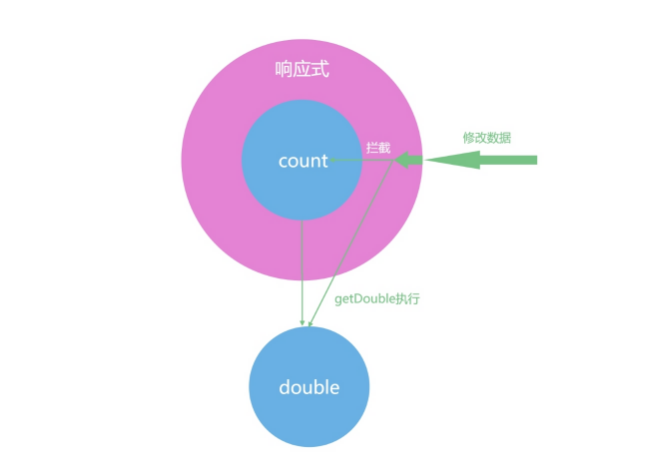
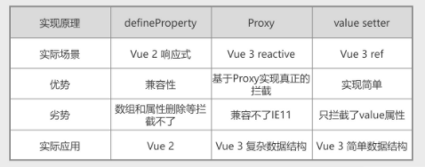

### 巧妙的响应式：理解Vue 3的响应式机制
#### 什么是响应式

响应式一直都是 Vue 的特色功能之一。与之相比，JavaScript 里面的变量，是没有响应式这个概念的。你在学习 JavaScript 的时候首先被灌输的概念，就是代码是自上而下执行的。我们先来看一段代码：

```Js
let count = 1
let double = count * 2
console.log(double)
count = 2
console.log(double)
```

我们看上面的代码，代码在执行后，打印输出的两次 double 的结果也都是2。即使我们修改了代码中的 count 的值后，double 的值也不会有任何改变。

double 的值是根据 count 的值乘以二计算而得到的，如果现在我们想让 doube 能够跟着 count 的变化而变化，那么我们就需要在每次 count 的值修改后，重新计算 double。

比如，在下面的代码，我们先把计算 doube 的逻辑封装成函数，然后在修改完 count 之后，再执行一遍，你就会得到最新的 double 值。
```JS
let count = 1
// 计算过程封装成函数
let getDouble = n=>n*2 //箭头函数
let double = getDouble(count)
console.log(double)

count = 2
// 重新计算double，这里我们不能自动执行对double的计算
double = getDouble(count)
console.log(double)
```

实际开发中的计算逻辑会比计算 doube 复杂的多，但是都可以封装成一个函数去执行。下一步，我们要考虑的是，如何让 double 的值得到自动计算。

如果我们能让 getDouble 函数自动执行，也就是如下图所示，我们使用 JavaScript 的某种机制，把 count 包裹一层，每当对 count 进行修改时，就去同步更新 double 的值，那么就有一种 double 自动跟着 count 的变化而变化的感觉，这就算是响应式的雏形了。



#### 响应式原理

响应式原理是什么呢？Vue 中用过三种响应式解决方案，分别是 defineProperty、Proxy 和 value setter。我们首先来看 Vue 2 的 defineProperty API。

在下面的代码中，我们定义个一个对象 obj，使用 defineProperty 代理了 count 属性。这样我们就对 obj 对象的 value 属性实现了拦截，读取 count 属性的时候执行 get 函数，修改 count 属性的时候执行 set 函数，并在 set 函数内部重新计算了 double。

```JS

// Object.defineProperty - get，用于 依赖收集
// Object.defineProperty - set，用于 依赖更新
let getDouble = n=>n*2
let obj = {}
let count = 1
let double = getDouble(count)

Object.defineProperty(obj,'count',{
    get(){
        return count
    },
    set(val){
        count = val
        double = getDouble(val)
    }
})
console.log(double)  // 打印2
obj.count = 2
console.log(double) // 打印4  有种自动变化的感觉
```

这样我们就实现了简易的响应式功能。

但 defineProperty API 作为 Vue 2 实现响应式的原理，它的语法中也有一些缺陷。比如在下面代码中，我们删除 obj.count 属性，set 函数就不会执行，double 还是之前的数值。这也是为什么在 Vue 2 中，我们需要 $delete 一个专门的函数去删除数据。
比如在下面代码:

```JS
delete obj.count
console.log(double) // doube还是4
```
当然还有以下缺陷：

```JS
<div id="app">{{ dengFamily }} {{deng}}</div>

const vm = new Vue({
  el: '#app'
  data: {
    dengFamily: ['邓哥', '小刘', '王小宝'],
    deng: {
      wife: '小刘',
      son: '王小宝',
      weight: '100kg',
      height: '140cm',
      age: 60
    }
  }
})
 // 不是响应式的
vm.dengFamily[3] = '铁锤妹妹';
vm.dengWife.length = 0; 
vm.deng.secondWife = '铁锤妹妹';
```

那么在vue2中我们要怎么做呢？

更改数组：
1. 利用数组变异方法：push、pop、shift、unshift、splice、sort、reverse
2. 利用vm.$set/Vue.set实例方法
3. 利用vm.$set或Vue.set删除数组中的某一项

更改对象：
1. 添加利用vm.$set/Vue.set实例方法
2. 删除利用vm.$delete/Vue.delete方法

----

Vue 3 的响应式机制是基于 Proxy 实现的。就 Proxy 这个名字来说，你也能看出来这是代理的意思，Proxy 的重要意义在于它解决了 Vue 2 响应式的缺陷。我们看下面的代码，在其中我们通过 new Proxy 代理了 obj 这个对象，然后通过 get、set 和 deleteProperty 函数代理了对象的读取、修改和删除操作，从而实现了响应式的功能。

```JS

let proxy = new Proxy(obj,{
    get : function (target,prop) {
        return target[prop]
    },
    set : function (target,prop,value) {
        target[prop] = value;
        if(prop==='count'){
            double = getDouble(value)
        }
    },
    deleteProperty(target,prop){
        delete target[prop]
        if(prop==='count'){
            double = NaN
        }
    }
})
console.log(obj.count,double)
proxy.count = 2
console.log(obj.count,double) 
delete proxy.count
// 删除属性后，我们打印log时，输出的结果就会是 undefined NaN
console.log(obj.count,double) 
```

我们从这里可以看出 Proxy 实现的功能和 Vue 2 的 definePropery 类似，它们都能够在用户修改数据的时候触发 set 函数，从而实现自动更新 double 的功能。而且 Proxy 还完善了几个 definePropery 的缺陷，比如说可以监听到属性的删除。

Proxy 是针对对象来监听，而不是针对某个具体属性，所以不仅可以代理那些定义时不存在的属性，还可以代理更丰富的数据结构，比如 Map、Set 等，并且我们也能通过 deleteProperty 实现对删除操作的代理。

当然，为了帮助你理解 Proxy，我们还可以把 double 相关的代码都写在 set 和 deleteProperty 函数里进行实现，在课程的后半程我会带你做好更完善的封装。比如下面代码中，Vue 3 的 reactive 函数可以把一个对象变成响应式数据，而 reactive 就是基于 Proxy 实现的。我们还可以通过 watchEffect，在 obj.count 修改之后，执行数据的打印。

```JS

import {reactive,computed,watchEffect} from 'vue'

let obj = reactive({
    count:1
})
let double = computed(()=>obj.count*2)
obj.count = 2

watchEffect(()=>{
    console.log('数据被修改了',obj.count,double.value)
})
```

有了 Proxy 后，响应式机制就比较完备了。但是在 Vue 3 中还有另一个响应式实现的逻辑，就是利用对象的 get 和 set 函数来进行监听，这种响应式的实现方式，只能拦截某一个属性的修改，这也是 Vue 3 中 ref 这个 API 的实现。在下面的代码中，我们拦截了 count 的 value 属性，并且拦截了 set 操作，也能实现类似的功能。

```JS

let getDouble = n => n * 2
let _value = 1
double = getDouble(_value)

let count = {
  get value() {
    return _value
  },
  set value(val) {
    _value = val
    double = getDouble(_value)

  }
}
console.log(count.value,double)
count.value = 2
console.log(count.value,double)
```

三种实现原理的对比表格如下，帮助你理解三种响应式的区别。



总结：

1. 为什么需要响应式？
   随着页面应用的不断复杂，需要关注和管理的状态越来越多，之前靠被动的，分散的管理状态不现实也易出错。为了满足这个需求，出现了许多方案，其中 Vue 提出的或主打的解决方案的就是响应式。
   
2. 怎么实现响应式？
   响应式主要解决的问题是怎么让在“语言层面上分散的独立数据”在“业务层面”上产生“联系或互为因果”的关系。这咋么办呢？怎么产生“联系”呢？简单，“你发生变化的时候告诉我一声，我应声而动”，所谓响应式我个人理解就是“你响我应”。

   但是这种需求在语言上不是“普遍需求”，属于“特殊需求”，怎么解决？这里就引入了“代理模式”这种设计模式。在语言层面我给你一种模式可以满足你的需求，ES5 的时代，是defineProperty 等，ES6 就是 Proxy。

   至于 ES6 的 Proxy 在性能或是各方面要优于 defineProperty 还是因为 Proxy 在更底层优化或重新实现，使用的表现“一样”，但“地基”不一样，性能各方面自然是不一样。正因为是“地基”的不同，Proxy 就还存在兼容性的问题, 加上业务场景的不同，defineProperty 还是有应用的场景，至于文中说的 Vue 3 的 ref 是用 “gettersetter” 实现的，我的认识是，一个是“初始化”时的行为，一个是“改变行为”。